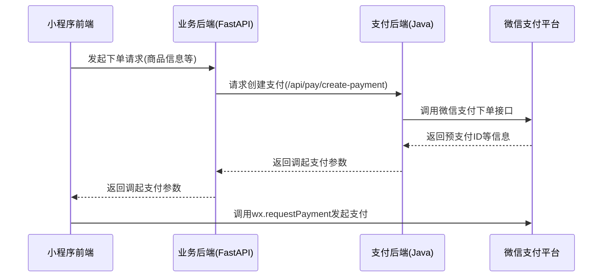
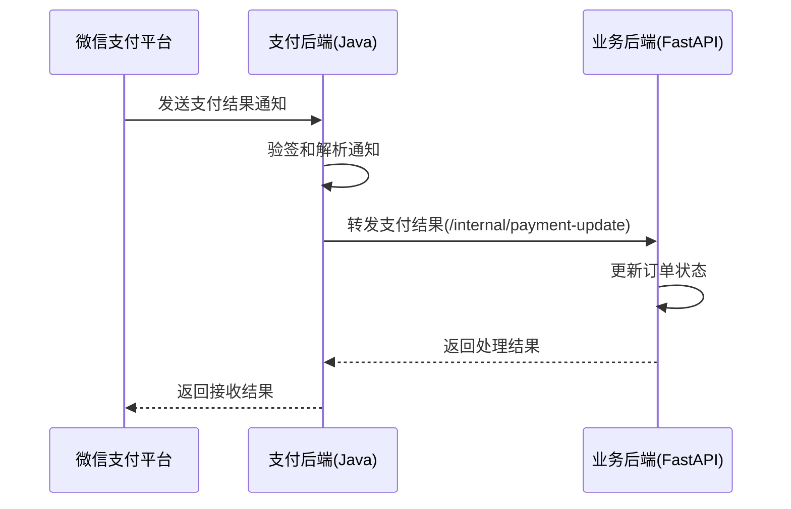

# 微信支付Java后端服务

## 项目简介

本项目是为小程序支付场景提供的Java后端服务，基于微信支付官方SDK `wechatpay-java`开发，支持JSAPI/小程序支付，包括下单、查询、关单、退款等完整功能。

项目采用Spring Boot框架，集成了微信支付官方SDK，提供RESTful API接口，便于业务后端（如基于FastAPI的Python后端）集成调用。

## 架构说明

整体业务架构为三层结构：

1. **小程序前端** - 负责用户界面交互，发起支付请求，展示支付结果
2. **业务后端** (Python/FastAPI) - 负责核心业务逻辑，管理订单，调用支付后端
3. **支付后端** (本项目) - 专门负责与微信支付交互，处理支付相关的所有操作

本项目不依赖数据库，所有支付状态由业务后端负责存储，支付后端仅作为微信支付的代理服务。

## 环境要求

- JDK 17+
- Maven 3.6+
- 微信支付商户号及相关密钥配置
- 可公网访问的回调通知URL（生产环境必须）

## 接入指南

### 1. 配置微信支付参数

编辑`application.yml`文件，配置以下参数：

```yaml
wechat:
  pay:
    app-id: ${WX_PAY_APP_ID:your_app_id}                 # 序 AppID
    mch-id: ${WX_PAY_MCH_ID:your_merchant_id}            # 商户号小程
    mch-serial-no: ${WX_PAY_MCH_SERIAL_NO:your_serial}   # 商户API证书序列号
    private-key-path: ${WX_PAY_PRIVATE_KEY_PATH:cert/apiclient_key.pem}  # 商户私钥文件路径
    api-v3-key: ${WX_PAY_API_V3_KEY:your_api_v3_key}     # 商户APIv3密钥
    notify-url: ${WX_PAY_NOTIFY_URL:https://your-domain.com/api/wechatpay/notify/payment}  # 支付结果通知URL
    refund-notify-url: ${WX_PAY_REFUND_NOTIFY_URL:https://your-domain.com/api/wechatpay/notify/refund}  # 退款通知URL
```

推荐使用环境变量进行配置，以提高安全性。

### 2. 准备证书文件

1. 在微信支付商户平台下载API证书
2. 提取证书中的私钥`apiclient_key.pem`，放置在项目指定位置（默认为`cert/apiclient_key.pem`）

### 3. 构建与运行

```bash
# 构建项目
mvn clean package

# 运行项目
java -jar target/javap-0.0.1-SNAPSHOT.jar
```

或者使用Docker运行（需要自行编写Dockerfile）：

```bash
# 构建镜像
docker build -t wxpay-service .

# 运行容器
docker run -p 8081:8081 -v /path/to/cert:/app/cert -e WX_PAY_APP_ID=xxx ... wxpay-service
```

### 4. 业务后端（FastAPI）接入

业务后端需要实现以下功能：

1. 调用支付后端创建支付订单
2. 接收并处理支付后端推送的支付结果
3. 根据业务需要查询订单状态、申请退款等

#### 4.1 创建支付订单流程



#### 4.2 支付结果通知流程



## API文档

服务启动后，访问以下地址查看Swagger API文档：
- http://localhost:8081/api/swagger-ui.html

### 通用响应格式

所有主动调用的API（非通知接口）都使用统一的JSON格式：

```json
{
  "code": 200,                  // 响应状态码，200 表示成功，非 200 表示失败
  "message": "操作成功",        // 响应消息
  "data": { ... },              // 响应数据，成功时可能包含业务数据，失败时通常为 null
  "requestId": "abc123..."      // 请求ID，用于跟踪和问题排查
}
```

### 主要接口说明

#### 1. 创建支付订单 (JSAPI/小程序)

-   **HTTP 方法**: `POST`
-   **路径**: `/api/pay/create-payment`
-   **描述**: 创建微信支付订单，并返回小程序调起支付所需的参数。
-   **请求体 (Request Body)** (`application/json`):
    ```json
    {
        "outTradeNo": "your_unique_order_id_123", // 商户订单号 (必填, String)
        "description": "商品简单描述",              // 商品描述 (必填, String)
        "amount": 100,                           // 支付金额 (单位: 分, 必填, Integer, >=1)
        "openid": "user_openid_from_wx_login",   // 用户 OpenID (必填, String)
        "attach": "附加数据，可选",                  // 附加数据 (可选, String)
        "timeExpire": "2025-12-31T23:59:59+08:00" // 订单失效时间 (可选, String, ISO 8601格式)
    }
    ```
-   **成功响应数据 (Response Body - data 字段)**:
    ```json
    {
        "appId": "wx_appid",             // 小程序ID
        "timeStamp": "1678888888",       // 时间戳 (秒)
        "nonceStr": "random_nonce_string",// 随机字符串
        "packageValue": "prepay_id=wx...",// 订单详情扩展字符串 (包含 prepay_id)
        "signType": "RSA",               // 签名方式
        "paySign": "calculated_signature",// 签名
        "outTradeNo": "your_unique_order_id_123" // 商户订单号
    }
    ```

#### 2. 查询订单状态

-   **HTTP 方法**: `POST`
-   **路径**: `/api/pay/query-status`
-   **描述**: 根据商户订单号或微信支付订单号查询订单状态。
-   **请求体 (Request Body)** (`application/json`): (两者任选其一)
    ```json
    // 方案一：通过商户订单号查询
    {
        "outTradeNo": "your_unique_order_id_123" // 商户订单号 (String)
    }

    // 方案二：通过微信支付订单号查询
    {
        "transactionId": "42000000..."          // 微信支付订单号 (String)
    }
    ```
-   **成功响应数据 (Response Body - data 字段)**: 微信支付 `Transaction` 对象 (具体字段参考微信支付官方文档)。关键字段包括：
    -   `out_trade_no`: 商户订单号
    -   `transaction_id`: 微信支付订单号
    -   `trade_state`: 交易状态 (e.g., `SUCCESS`, `REFUND`, `NOTPAY`, `CLOSED`, `REVOKED`, `USERPAYING`, `PAYERROR`)
    -   `trade_state_desc`: 交易状态描述
    -   `amount.total`: 总金额 (分)
    -   `payer.openid`: 支付者 OpenID
    -   `success_time`: 支付成功时间 (ISO 8601)
    -   ... 等

#### 3. 关闭订单

-   **HTTP 方法**: `POST`
-   **路径**: `/api/pay/close-order/{outTradeNo}`
-   **描述**: 关闭未支付的订单。
-   **路径参数 (Path Parameter)**:
    -   `outTradeNo` (String): 需要关闭的商户订单号。
-   **成功响应数据 (Response Body - data 字段)**: `null` (操作成功即可，无特定业务数据返回)

#### 4. 申请退款

-   **HTTP 方法**: `POST`
-   **路径**: `/api/pay/refund`
-   **描述**: 对已支付的订单发起退款申请。
-   **请求体 (Request Body)** (`application/json`): (订单号 transactionId 和 outTradeNo 任选其一)
    ```json
    {
        "transactionId": "42000000...",          // 微信支付订单号 (可选, String)
        "outTradeNo": "your_unique_order_id_123", // 商户订单号 (可选, String)
        "outRefundNo": "your_unique_refund_id_123",// 商户退款单号 (必填, String)
        "reason": "商品已退货",                    // 退款原因 (可选, String)
        "amount": 100,                           // 退款金额 (单位: 分, 必填, Integer, >=1)
        "totalAmount": 100                      // 原订单金额 (单位: 分, 必填, Integer, >=1)
    }
    ```
-   **成功响应数据 (Response Body - data 字段)**: 微信支付 `Refund` 对象 (具体字段参考微信支付官方文档)。关键字段包括：
    -   `refund_id`: 微信支付退款单号
    -   `out_refund_no`: 商户退款单号
    -   `transaction_id`: 微信支付订单号
    -   `out_trade_no`: 商户订单号
    -   `status`: 退款状态 (e.g., `SUCCESS`, `CLOSED`, `PROCESSING`, `ABNORMAL`)
    -   `amount.refund`: 退款金额 (分)
    -   `amount.total`: 原订单金额 (分)
    -   ... 等

#### 5. 查询退款状态

-   **HTTP 方法**: `GET`
-   **路径**: `/api/pay/refund/{outRefundNo}`
-   **描述**: 根据商户退款单号查询退款状态。
-   **路径参数 (Path Parameter)**:
    -   `outRefundNo` (String): 需要查询的商户退款单号。
-   **成功响应数据 (Response Body - data 字段)**: 微信支付 `Refund` 对象 (字段同上)。

#### 6. 支付结果通知回调

-   **HTTP 方法**: `POST`
-   **路径**: `/api/wechatpay/notify/payment`
-   **描述**: 接收微信支付平台发送的支付结果异步通知。**此接口由微信平台调用，业务系统无需主动调用。** URL 需配置在微信支付商户后台。
-   **请求头 (Request Headers)**:
    -   `Wechatpay-Serial`: 微信支付平台证书序列号
    -   `Wechatpay-Signature`: 签名
    -   `Wechatpay-Timestamp`: 时间戳
    -   `Wechatpay-Nonce`: 随机数
-   **请求体 (Request Body)** (`application/json`): 微信支付加密的通知报文。
-   **响应 (Response Body)** (`application/json`): (固定格式，用于告知微信平台处理结果)
    -   成功: `{"code": "SUCCESS", "message": "成功"}`
    -   失败: `{"code": "FAIL", "message": "失败原因"}`

#### 7. 退款结果通知回调

-   **HTTP 方法**: `POST`
-   **路径**: `/api/wechatpay/notify/refund`
-   **描述**: 接收微信支付平台发送的退款结果异步通知。**此接口由微信平台调用，业务系统无需主动调用。** URL 需配置在微信支付商户后台。
-   **请求头 (Request Headers)**: (同支付结果通知)
-   **请求体 (Request Body)** (`application/json`): 微信支付加密的通知报文。
-   **响应 (Response Body)** (`application/json`): (同支付结果通知)

## 数据库说明

本项目不使用数据库，理由如下：

1. **职责单一**: 支付后端只负责与微信支付交互，不保存业务数据。订单、支付记录等业务数据由业务后端负责存储。
2. **减少依赖**: 无数据库依赖使得部署更简单，不需要配置和维护额外的数据库服务。
3. **避免数据不一致**: 支付数据只在一处（业务后端）管理，避免了数据同步和一致性问题。

唯一需要持久化的是微信支付平台证书，微信支付SDK会自动缓存到内存中，定期更新。

## 问题排查

1. **日志查看**: 查看`logs/wxpay-service.log`了解详细日志
2. **健康检查**: 访问`/api/actuator/health`查看服务健康状态
3. **常见问题**:
   - 验签失败: 检查商户证书、序列号和API v3密钥配置
   - 通知回调问题: 确保通知URL可以公网访问，且使用HTTPS协议
   - 签名问题: 检查私钥文件是否正确，路径是否可访问

## 安全建议

1. 使用环境变量而非硬编码方式配置敏感信息
2. 定期更新商户API证书
3. 为业务后端与支付后端的通信增加认证机制
4. 使用HTTPS协议保护API通信安全
5. 部署在内网或使用网络访问控制限制IP

## 注意事项

1. 支付金额单位为**分**，如100元需传入10000
2. 异步通知为最终支付结果，小程序支付成功回调非最终结果
3. 商户订单号(`outTradeNo`)是业务系统与支付后端关联的重要标识，确保唯一性
4. 生产环境中，`notify_url`必须是可公网访问的HTTPS URL
5. 业务后端需要校验支付后端转发的通知，防止伪造通知 